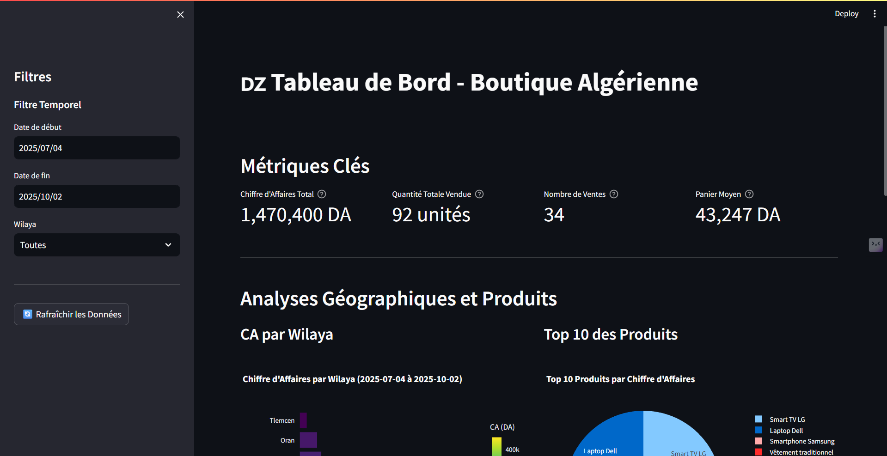
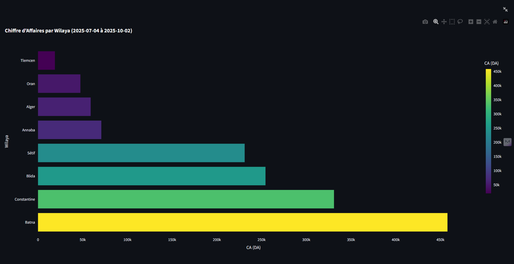
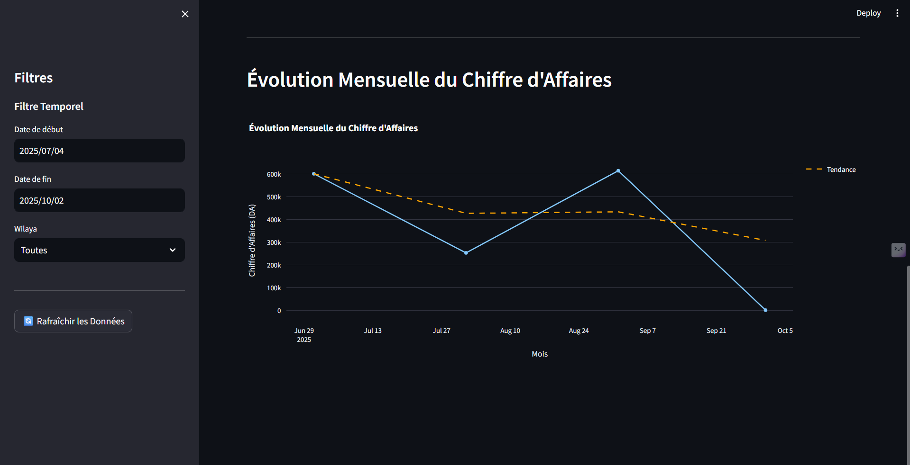
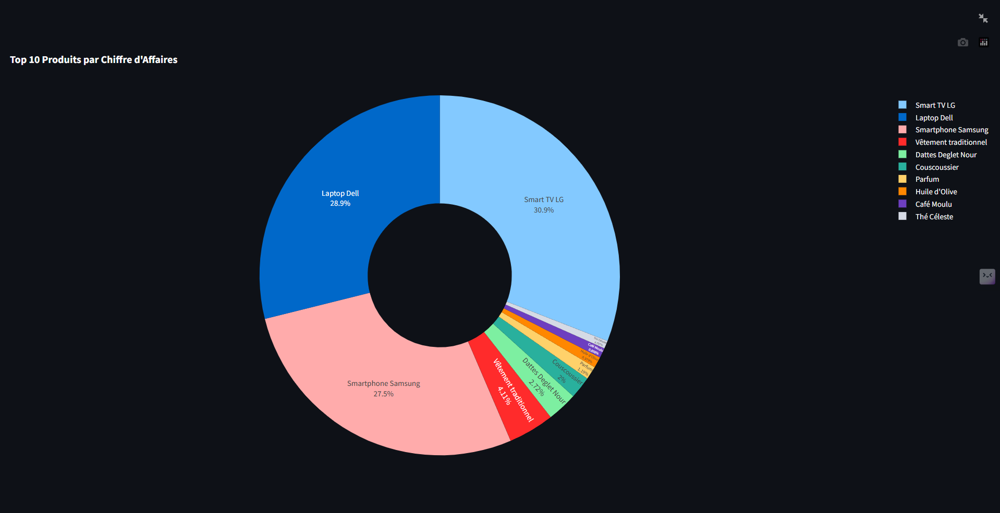

# Tableau de Bord Boutique Algérie

Application Streamlit pour analyser les ventes d'une boutique algérienne.

## Quick Start

```bash
pip install streamlit pandas plotly
streamlit run streamlit.py
```

## Fichiers

- `streamlit.py` - Application principale
- `create_database.py` - Crée la base de données
- `Ventes_Boutique.db` - Base SQLite (auto-générée)


## Captures d'Écran

### Tableau de Bord Principal


### CA par Wilaya  


### Évolution Mensuelle


### Détail des Ventes



## Fonctionnalités

- Chiffre d'affaires total & quantité vendue
- CA par wilaya algérienne  
- Top 10 produits
- Évolution mensuelle du CA
- Filtres date + wilaya

## Métriques

- **CA Total** - Somme des ventes en DA
- **Quantité Vendue** - Unités vendues
- **Panier Moyen** - CA par transaction
- **Top Produits** - Classement par performance

---

*Développé avec Streamlit + SQLite*